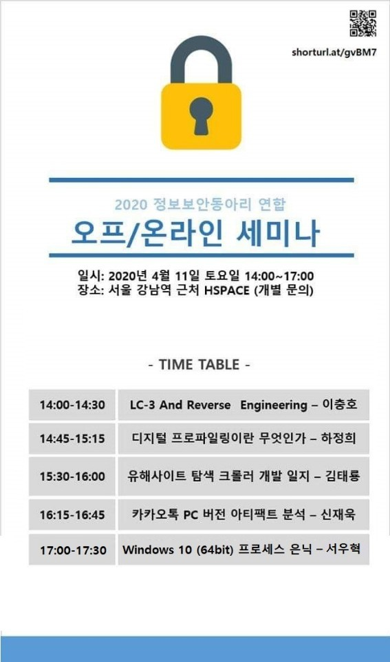
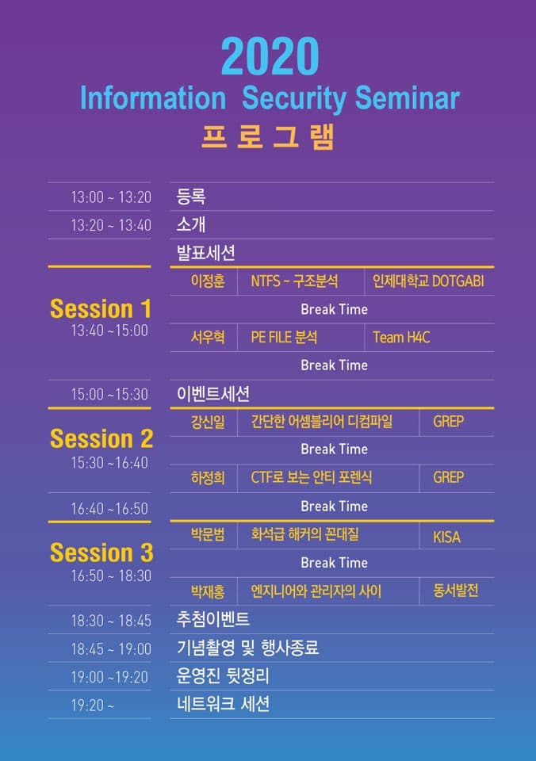
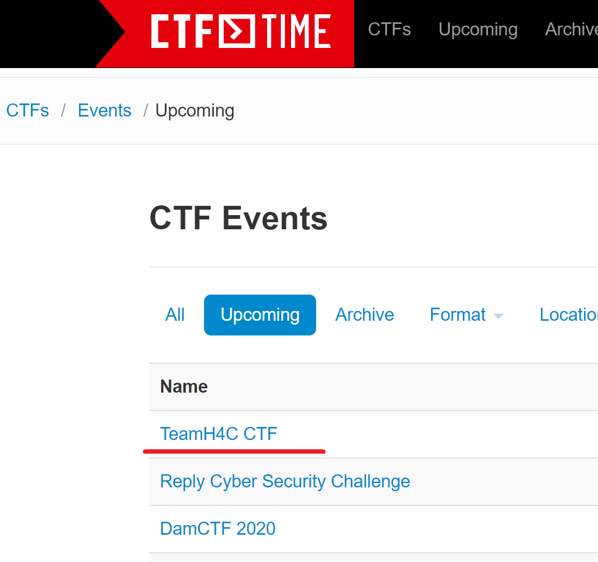

| 이름                               | 내용                                                         |
| ---------------------------------- | ------------------------------------------------------------ |
| (API Call Tracer) ACT              | Windows OS 환경에서 자동으로 프로그램을 분석해주는 도구를 개발했습니다. 해당 도구는 특정 API에 BP를 설치하여 디버깅을 자동으로 진행하여 리버싱을 자동화합니다. https://github.com/traitor0213/act |
| httplibrary                        | C/C++ 개발환경에서 HTTP client & server 개발기간을 단축하기 위한 라이브러리를 개발했습니다. https://github.com/traitor0213/httplib |
| universal-shellcode                | GetProcAddress, GetModuleHandle API를 어셈블리를 사용하여 구현했습니다. https://github.com/traitor0213/universal-shellcode |
| Stealth process                    | windows x64 환경에서 code injection을 통한 프로세스 은닉을 구현했습니다.   https://traitors-biscuit.tistory.com/entry/stealth-process-in-x64 |
| Process hollowing                  | 악성코드가 안티바이러스를 우회하기 위해서 사용하는 기법중 하나인 process hollowing을 실습했습니다. https://traitors-biscuit.tistory.com/entry/About-process-hollowing |
| LCO library (Local Code Overwrite) | 안티바이러스가 특정 API를 후킹하여 탐지하는 과정을 우회하는 라이브러리를 개발했습니다. https://sleepy-cat-0213.tistory.com/7 |

| 운영중인 블로그                       |
| ------------------------------------- |
| https://traitors-biscuit.tistory.com/ |
| https://sleepy-cat-0213.tistory.com/  |

- 발표 경력

| 활동 날짜  | 활동 정보                                                    |
| ---------- | ------------------------------------------------------------ |
| 2020/04/11 | 정보보안동아리 연합 Windows 10 (x64) 프로세스 은닉 |
| 2020/07/28 | 울산권역 대학교 정보보호 동아리 연합 세미나 PE 구조 분석, 윈도우 운영체제 구조 발표 |
| 2020/10/09 | TeamH4C CTF 문제 출제자 (https://ctf.teamh4c.com/) |